# Space Travel Protocol: Sequence Diagram

The following diagram illustrates the lifecycle of a travel transaction using the **Elected Traffic Controllers (ETC)** consensus protocol.

```mermaid
sequenceDiagram
    participant Traveler as Ship Browser
    participant Origin as Origin Space Port
    participant TCs as Elected Traffic Controllers (3f+1)
    participant Dest as Destination Space Port
    participant D1 as D1 Database / Ledger

    Note over Traveler, Dest: PHASE 1: INITIATION & SORTITION
    Traveler->>Origin: POST /initiate (Destination, ShipID)
    Origin->>Origin: Calculate 3D Coordinates & Time
    Origin->>Origin: Elect TCs from direct neighbors (Seed-based)
    Origin->>Origin: Sign Plan (Ed25519)
    Origin->>TCs: Broadcast PRE-PREPARE (Signed Plan)

    Note over TCs, D1: PHASE 2: CONSENSUS (PBFT)
    loop Validation
        TCs->>TCs: Verify Plan integrity (Hash & Math)
        TCs->>TCs: Sign Plan
        TCs->>Origin: POST /prepare (Signed by TC)
        TCs->>TCs: Broadcast COMMIT to other TCs
    end

    Note over Origin, D1: PHASE 3: RECORDING & TRANSIT
    Origin->>Origin: Collect Quorum (2f+1 signatures)
    Origin->>D1: Persist Approved Plan
    Origin-->>Traveler: 200 OK (Travel Authorized)
    
    Note over Origin, Traveler: Ship Status: PREPARING
    
    rect rgb(20, 25, 35)
        Note right of Origin: Wait for Start_Timestamp
    end

    Note over Origin, Traveler: Ship Status: DEPARTING / TRANSIT
    Note over Dest, Traveler: Ship Status: INCOMING (ETA displayed)

    rect rgb(20, 25, 35)
        Note right of Origin: Wait for End_Timestamp
    end

    Note over Traveler, Dest: PHASE 4: ARRIVAL & ARCHIVAL
    Traveler->>Dest: Request Landing (Present Signed Plan)
    Dest->>Dest: Verify Signatures & End_Timestamp
    Dest->>D1: Update Status: ARRIVED
    Dest->>D1: Move to Mission Archive (Last 10)
    Dest-->>Traveler: Landing Cleared (Welcome!)
```

## Protocol Summary

1.  **Initiation:** The origin calculates the plan and elects neighbors to act as controllers.
2.  **Consensus:** A Byzantine Fault Tolerant subset ($3f+1$) validates and signs the plan.
3.  **Recording:** Once $2f+1$ signatures are collected, the plan is immutable and recognized by the federation.
4.  **Transit:** Time is enforced by the federation; landing is only permitted after `End_Timestamp`.
5.  **Archival:** Completed journeys are moved to an audit log.
