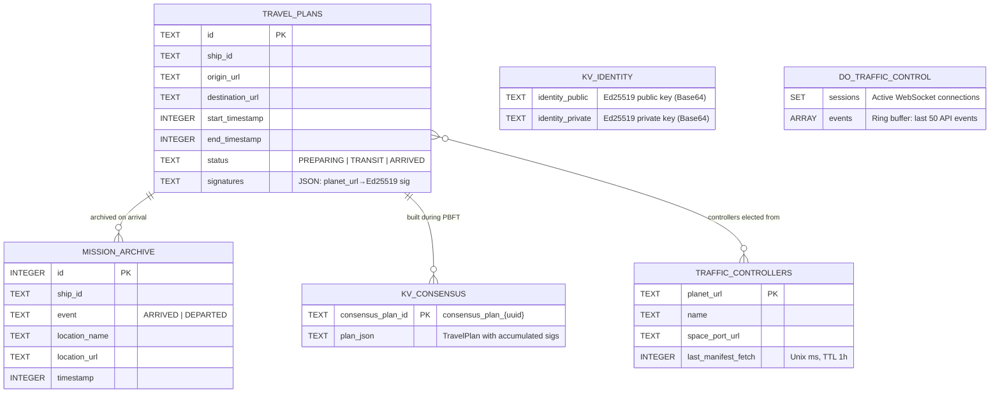

# Space Travel Protocol: Sequence Diagram

The following diagram illustrates the lifecycle of a travel transaction using the **Elected Traffic Controllers (ETC)** consensus protocol.

```mermaid
sequenceDiagram
    participant Traveler as Ship Browser
    participant DO as TrafficControl DO
    participant Origin as Origin Space Port
    participant KV as KV Store
    participant D1 as D1 Database
    participant TCs as Elected Traffic Controllers (3f+1)
    participant Dest as Destination Space Port

    Note over Traveler, Dest: PHASE 1: INITIATION & SORTITION
    Traveler->>Origin: POST /initiate (Destination, ShipID)
    Origin->>D1: Lookup cached space port manifests (traffic_controllers)
    D1-->>Origin: Neighbor manifests
    opt Cache miss
        Origin->>Dest: Fetch space-manifest link + manifest JSON
        Dest-->>Origin: PlanetManifest (name, landing_site, space_port)
        Origin->>D1: Store manifest in traffic_controllers cache
    end
    Origin->>Origin: Calculate 3D Coordinates & Travel Time
    Origin->>Origin: Elect TCs from neighbors (seed-based sortition)
    Origin->>KV: Read Ed25519 identity keys (identity_public/private)
    KV-->>Origin: Key pair
    Origin->>Origin: Sign Plan (Ed25519)
    Origin->>KV: Save consensus plan state (consensus_plan_{id})
    par Fire-and-forget
        Origin-->>DO: INITIATE_TRAVEL event
    and Parallel POST ×N
        Origin->>TCs: PRE-PREPARE (Signed Plan)
    end

    Note over TCs, KV: PHASE 2: CONSENSUS (PBFT)
    loop Each Traffic Controller
        TCs->>TCs: Verify Plan integrity (coordinates & travel time)
        TCs->>KV: Read own identity keys
        TCs->>TCs: Sign Plan
        TCs->>KV: Merge signatures into consensus plan state
        par Fire-and-forget
            TCs-->>DO: PREPARE_PLAN event
        and Parallel POST ×N
            TCs->>TCs: COMMIT (Signed Plan)
        end
    end

    Note over Origin, D1: PHASE 3: RECORDING & TRANSIT
    Origin->>KV: Read accumulated signatures (consensus_plan_{id})
    Origin->>Origin: Check quorum (2f+1 signatures reached)
    Origin->>D1: Persist Approved Plan (travel_plans, status=TRANSIT)
    Origin->>D1: Record DEPARTED in mission_archive
    Origin->>DO: Broadcast QUORUM_REACHED event
    DO-->>Traveler: WebSocket push (status updates to live UI)
    Origin-->>Traveler: 200 OK (Travel Authorized)

    Note over Origin, Traveler: Ship Status: PREPARING

    rect rgb(20, 25, 35)
        Note right of Origin: Wait for Start_Timestamp
    end

    Note over Origin, Traveler: Ship Status: DEPARTING / TRANSIT
    Note over Traveler: Ship Status: INCOMING (ETA displayed)

    rect rgb(20, 25, 35)
        Note right of Origin: Wait for End_Timestamp
    end

    Note over Traveler: Ship Status: ARRIVED (client-side only)
```

## Protocol Summary

1.  **Initiation:** The origin calculates the plan and elects neighbors to act as controllers.
2.  **Consensus:** A Byzantine Fault Tolerant subset ($3f+1$) validates and signs the plan.
3.  **Recording:** Once $2f+1$ signatures are collected, the plan is immutable and recognized by the federation.
4.  **Transit:** Time is enforced by the federation; arrival status is tracked client-side via ETA timestamps.

> **Note:** Phase 4 (arrival verification at the destination space port via `POST /land`) is not yet implemented. Arrival is currently client-side only — the browser transitions ship status to ARRIVED when `end_timestamp` is reached.

## Data Storage

| Store              | Purpose                                                        | Durability                        |
| ------------------ | -------------------------------------------------------------- | --------------------------------- |
| **D1**             | `travel_plans`, `mission_archive`, `traffic_controllers` cache | Persistent                        |
| **KV**             | Ed25519 identity key pair, in-flight consensus plan state      | Persistent (keys), TTL 1h (plans) |
| **Durable Object** | WebSocket sessions, last-50 event ring buffer                  | In-memory only (volatile)         |

## Entity-Relationship Diagram

