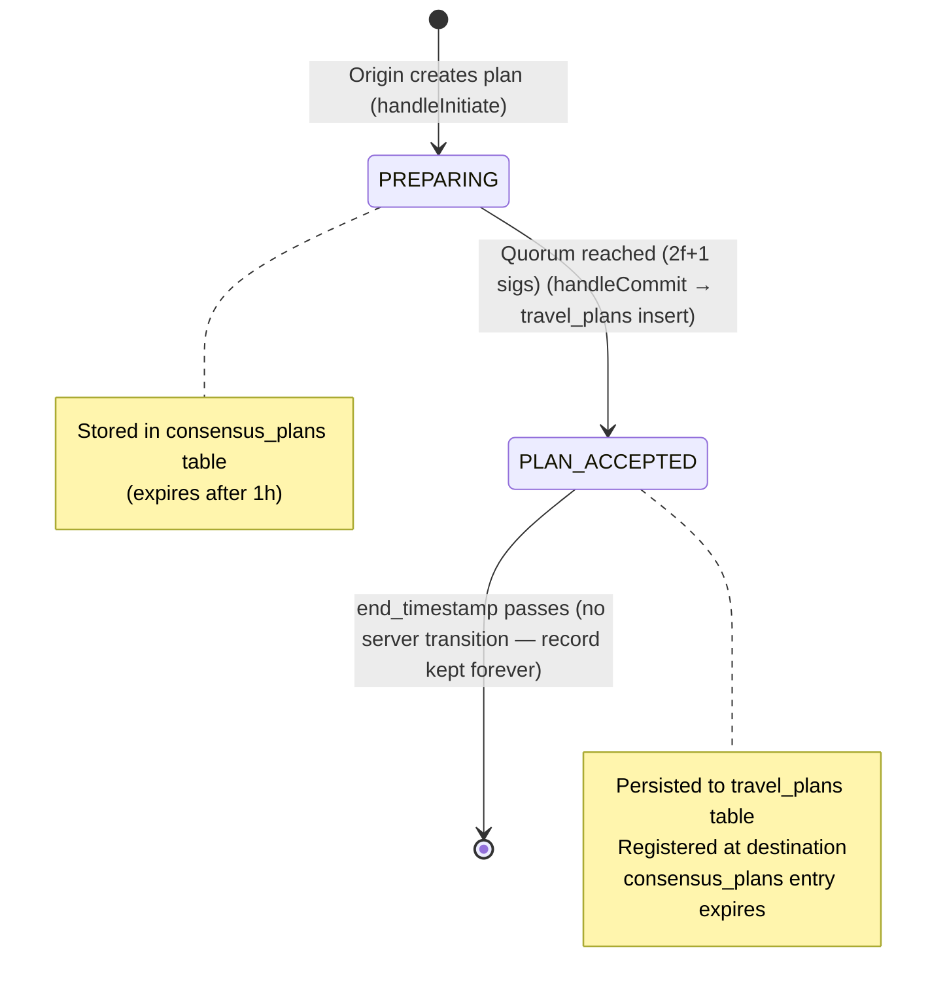
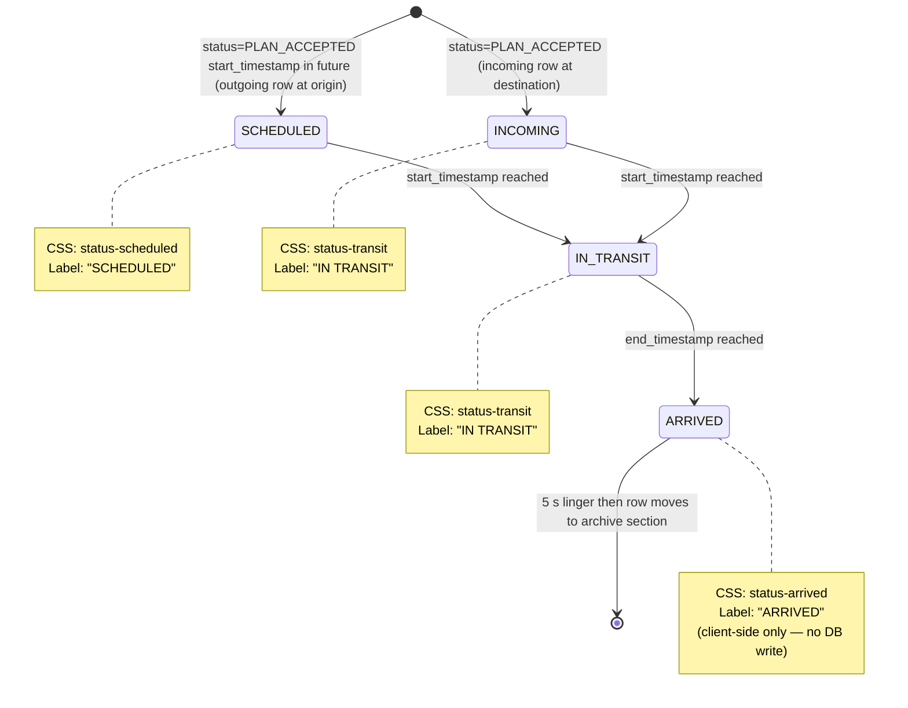
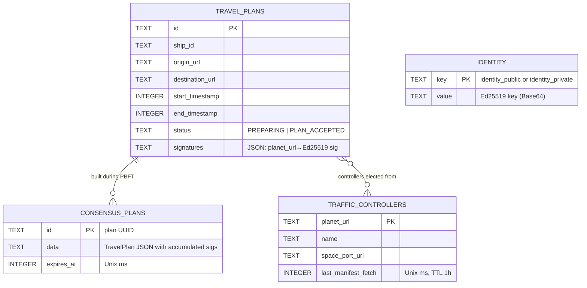

# Space Travel Protocol: Sequence Diagram

The following diagram illustrates the lifecycle of a travel transaction using the **Elected Traffic Controllers (ETC)** consensus protocol.

```mermaid
sequenceDiagram
    participant Traveler as 🚀 Ship Browser
    participant DO as TrafficControl DO (SQLite)
    participant Origin as 🌍 Origin Space Port
    participant Dest as 🌍 Destination Space Port
    participant TCs as 🌐 Elected Traffic Controllers (3f+1)

    Note over Traveler, Dest: PHASE 1: INITIATION & SORTITION
    Traveler->>Origin: POST /initiate (Destination, ShipID)
    par Parallel discovery
        Origin->>DO: Lookup cached manifests for origin neighbors
        DO-->>Origin: Origin neighbor manifests
        opt Cache miss
            Origin->>Dest: Fetch space-manifest link + manifest JSON
            Dest-->>Origin: PlanetManifest (name, landing_site, space_port)
            Origin->>DO: Store manifest in traffic_controllers cache
        end
    and
        Origin->>Dest: GET ?action=neighbors
        Dest-->>Origin: Dest neighbor manifests
    end
    Origin->>Origin: Calculate 3D Coordinates & Travel Time
    Note over Origin: Mandatory TCs: Origin + Destination
    Note over Origin: Elected TCs: half from origin neighbors, half from dest neighbors
    Origin->>Origin: Elect TCs (seed-based sortition, dedup)
    Origin->>DO: Read Ed25519 identity keys
    DO-->>Origin: Key pair
    Origin->>Origin: Sign Plan (Ed25519)
    Origin->>DO: Save consensus plan state
    par Fire-and-forget
        Origin-->>DO: INITIATE_TRAVEL event
    and Parallel POST ×N
        Origin->>TCs: PRE-PREPARE (Signed Plan)
    end

    Note over TCs, DO: PHASE 2: CONSENSUS (PBFT)
    loop Each Traffic Controller
        TCs->>TCs: Verify Plan integrity (coordinates & travel time)
        TCs->>DO: Read own identity keys
        TCs->>TCs: Sign Plan
        TCs->>DO: Merge signatures into consensus plan state
        par Fire-and-forget
            TCs-->>DO: PREPARE_PLAN event
        and Parallel POST ×N
            TCs->>TCs: COMMIT (Signed Plan)
        end
    end

    Note over Origin, DO: PHASE 3: RECORDING & TRANSIT
    Origin->>DO: Read accumulated signatures
    Origin->>Origin: Check quorum (2f+1 signatures reached)
    Origin->>Dest: POST ?action=register (Approved Plan)
    Dest->>Dest: Verify destination URL
    Dest->>Dest: Verify travel time math
    Dest->>Dest: Verify end_timestamp not expired (anti-cheat)
    Dest->>Dest: Verify quorum (2f+1 signatures)
    Dest->>DO: Store plan (incoming traffic)
    Dest-->>Origin: 200 OK
    Origin->>DO: Persist Approved Plan (travel_plans, status=PLAN_ACCEPTED)
    Origin->>DO: Broadcast QUORUM_REACHED event
    DO-->>Traveler: WebSocket push (status updates to live UI)
    Origin-->>Traveler: 200 OK (Travel Authorized)

    Note over Origin, Traveler: Ship Status: PREPARING

    rect rgb(20, 25, 35)
        Note right of Origin: Wait for Start_Timestamp
    end

    Note over Origin, Traveler: Ship Status: DEPARTING / IN TRANSIT (UI label)
    Note over Traveler: Ship Status: INCOMING (ETA displayed)

    rect rgb(20, 25, 35)
        Note right of Origin: Wait for End_Timestamp
    end

    Note over Traveler: Ship Status: ARRIVED (client-side only)
```

## Protocol Summary

1.  **Initiation:** The origin discovers its own neighbors and the destination's neighbors, then elects TCs: origin and destination are mandatory participants; remaining slots filled half from each neighbor pool.
2.  **Consensus:** All elected TCs (including origin and destination) validate and sign the plan. Quorum requires $2f+1$ signatures; since origin and destination are both mandatory TCs, both must contribute.
3.  **Recording:** Once quorum is reached, origin synchronously registers the plan with the destination (which verifies and stores it). Only after the destination confirms does origin persist the plan locally, broadcast the WebSocket event, and return 200 OK to the traveler.
4.  **Transit:** Time is enforced by the federation; arrival status is tracked client-side via ETA timestamps.

## Data Storage

All persistent storage lives in the TrafficControl Durable Object's built-in SQLite database:

| Table                | Purpose                                          | Durability                        |
| -------------------- | ------------------------------------------------ | --------------------------------- |
| `travel_plans`       | Active and historical journeys                   | Persistent                        |
| `traffic_controllers`| Cached neighbor manifests (1h TTL via timestamp) | Persistent                        |
| `identity`           | Ed25519 key pair                                 | Persistent                        |
| `consensus_plans`    | In-flight consensus plan state                   | Persistent (1h expiry)            |

The DO also holds in-memory state: WebSocket sessions and a last-50 event ring buffer (volatile).

## Plan Data State Diagram

Server-side status stored in `travel_plans.status` and the in-flight `consensus_plans` table:

## Plan UI Labels State Diagram

Client-side display labels derived from server status + timestamps:

## Entity-Relationship Diagram

